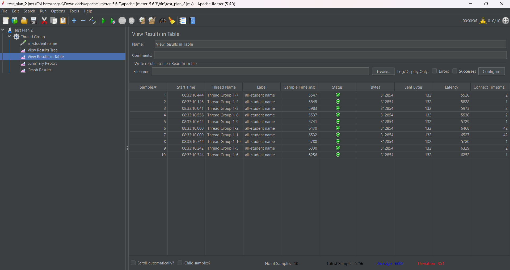
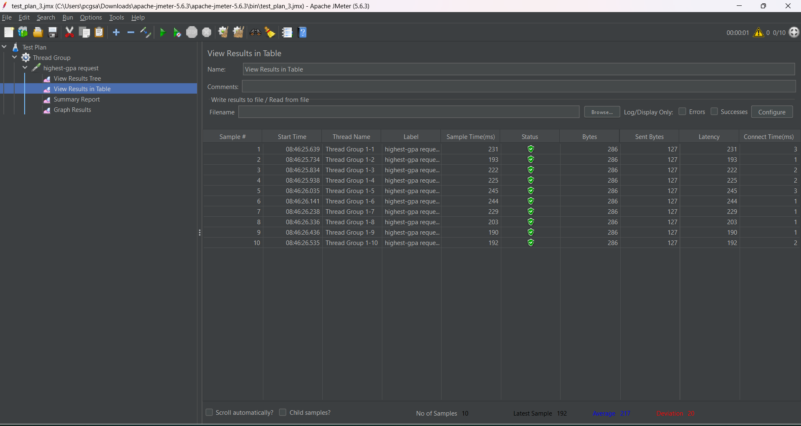
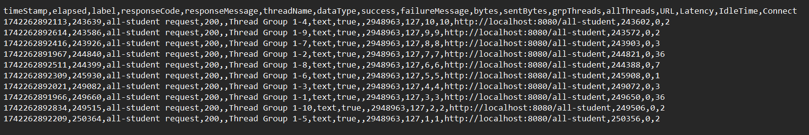
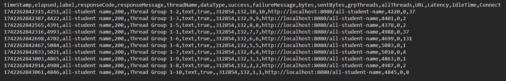
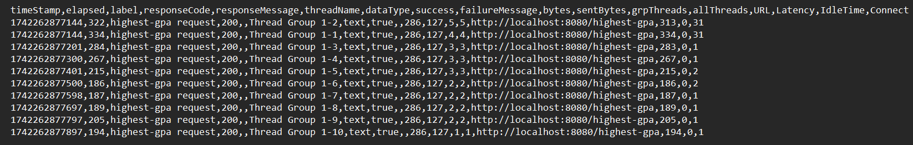
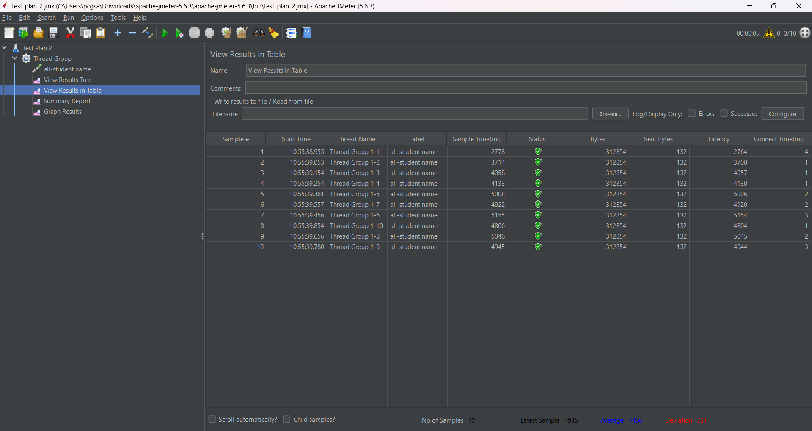
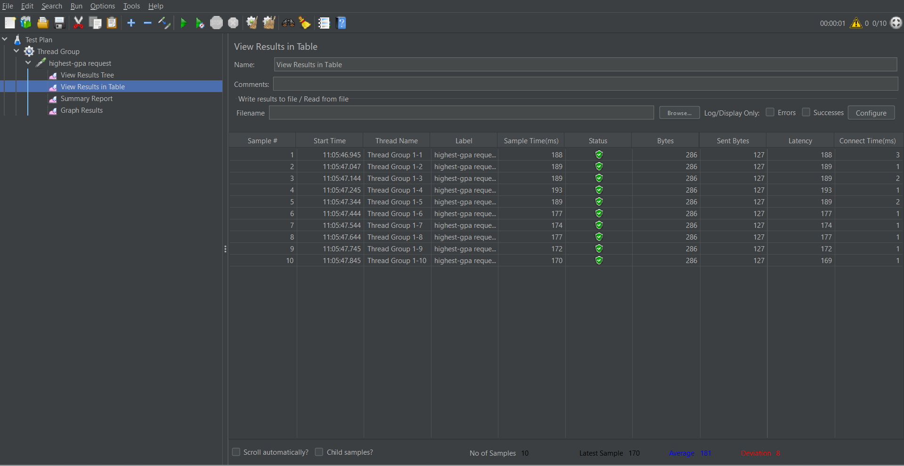
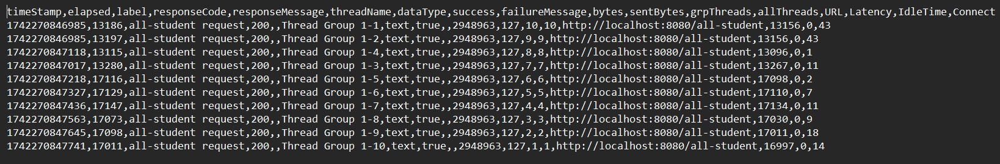
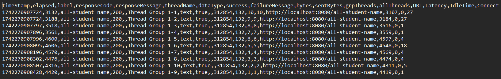
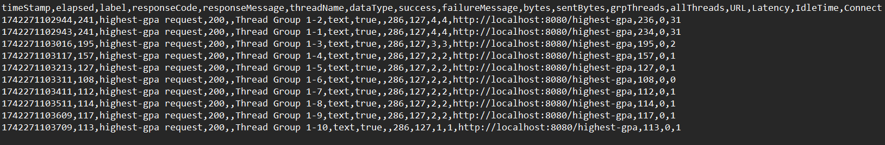

# JMeter GUI Test Plan Results 
## GUI Before Profiling
1. `/all-students` endpoint:  
   

2. `/all-student-name` endpoint:  
   

3. `/highest-gpa` endpoint:  
   

## CLI Before Profiling

1. `/all-students` endpoint:  
   

2. `/all-student-name` endpoint:  
   

3. `/highest-gpa` endpoint:  
   

## GUI After Profiling

1. `/all-students` endpoint:  
   

2. `/all-student-name` endpoint:  
   

3. `/highest-gpa` endpoint:  
   

## CLI After Profiling

1. `/all-students` endpoint:  
   

2. `/all-student-name` endpoint:  
   

3. `/highest-gpa` endpoint:  
   

## Conclusion

Perbandingan Hasil Pengujian

| Endpoint           | Sebelum (ms) | Sesudah (ms) | Peningkatan (%)          |
|-------------------|-------------|-------------|--------------------------|
| **/all-students**    | 256,547      | 15,685       | **↓ 93.89% lebih cepat** |
| **/all-student-name** | 6,202        | 4,456        | **↓ 28.15% lebih cepat** |
| **/highest-gpa**      | 217          | 181          | **↓ 16.59% lebih cepat** |

Setelah dilakukan proses profiling dan optimasi, hasil pengujian menggunakan JMeter menunjukkan bahwa semua endpoint mengalami peningkatan performa. Peningkatan paling signifikan terjadi pada endpoint /all-students, yang mengalami pengurangan waktu eksekusi hingga 93,89%, membuktikan bahwa optimasi telah berhasil mengatasi bottleneck utama program dan meningkatkan efisiensi pemrosesan data secara keseluruhan.